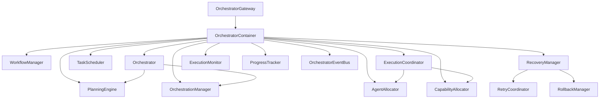

# A10 Enterprise AI Orchestrator — Implementation Report

## 1. Executive Summary

The A10 Enterprise AI Orchestrator is the final module of the IIOS AI Platform.
It provides the executive control plane that coordinates all other AI Platform
modules (A1–A9) without performing analysis, implementing trading strategies,
or calling broker APIs.

| Metric | Value |
|---|---|
| Module root | `iios/ai/orchestrator/` |
| Files created | 31 |
| Error codes | AI-1500 – AI-1563 (29 classes) |
| Test cases | 212 / 212 ✅ |
| Full suite (A1–A10) | 1607 / 1607 ✅ (zero regressions) |
| Architecture | M1-M6 six-layer (lifecycle → engine → policy → core → snapshot → container/gateway) |
| Version | 1.0.0 |
| Commit | `01bfd8a` |
| VPS | Both containers `Up (healthy)` ✅ |

---

## 2. Architecture Overview

```
M1  lifecycle/        AILifecycleAwareMixin re-exports (A1 primitive)
M2  engine/           PlanningEngine, WorkflowManager, Orchestrator + OrchestrationManager
M3  policy/           TaskScheduler, ResourceCoordinator, RecoveryManager
M4  core/ exceptions/ frozen dataclasses + 29-class exception hierarchy
M5  snapshot/         OrchestratorSnapshot
M6  container/ gateway/ OrchestratorContainer (DI root) + OrchestratorGateway (public entry)
    observability/    ExecutionMonitor, ProgressTracker, Timeline, ExecutionMetrics
    events/           25 typed events + OrchestratorEventBus
```



---

## 3. Components Implemented

### Exceptions (`exceptions/orchestrator_exceptions.py`)
29 exception classes, error codes AI-1500 – AI-1563:

| Group | Range | Classes |
|---|---|---|
| Base | AI-1500 | `AIOrchestrationException` |
| Objective | AI-1510–1513 | `AIObjectiveException`, `AIObjectiveNotFoundError`, `AIObjectiveAlreadyExistsError`, `AIObjectiveValidationError` |
| Planning | AI-1520–1524 | `AIPlanningException`, `AIPlanNotFoundError`, `AIPlanGenerationError`, `AIPlanDependencyError`, `AIReplanningError` |
| Workflow | AI-1530–1535 | `AIWorkflowException`, `AIWorkflowNotFoundError`, `AIWorkflowAlreadyExistsError`, `AIWorkflowStateError`, `AIWorkflowExecutionError`, `AIWorkflowTimeoutError` |
| Scheduler | AI-1540–1544 | `AITaskSchedulerException`, `AITaskNotFoundError`, `AITaskQueueFullError`, `AITaskDependencyError`, `AITaskExecutionError` |
| Resource | AI-1550–1553 | `AIResourceException`, `AIAgentNotAvailableError`, `AIResourceExhaustedError`, `AIAllocationConflictError` |
| Recovery | AI-1560–1563 | `AIRecoveryException`, `AIRecoveryFailedError`, `AIRollbackFailedError`, `AIMaxRetriesExceededError` |

### Core Types (`core/`)

**Status Enums** (`orchestration_types.py`):
- `ObjectiveStatus` — PENDING / PLANNING / EXECUTING / COMPLETED / FAILED / CANCELLED; `is_terminal()`
- `PlanStatus` — DRAFT / READY / EXECUTING / COMPLETED / FAILED / CANCELLED; `is_terminal()`
- `WorkflowStatus` — PENDING / RUNNING / PAUSED / COMPLETED / FAILED / CANCELLED; `is_terminal()`, `is_active()`
- `TaskStatus` — PENDING / QUEUED / RUNNING / COMPLETED / FAILED / CANCELLED / RETRYING; `is_terminal()`
- `StepStatus` — PENDING / RUNNING / COMPLETED / FAILED / SKIPPED; `is_terminal()`
- `ExecutionMode` — SEQUENTIAL / PARALLEL / MIXED

**Orchestration Context** (`orchestration_context.py`):
- `OrchestrationContext` (frozen) — objective, principal_id, session_id, trace_id, metadata kv pairs; `create()`, `get_meta()`
- `OrchestrationSession` (frozen) — context, status, started_at, state_items; `with_status()`, `with_state()`, `get_state()`
- `OrchestrationResult` (frozen) — status, output, error_message, steps_completed/failed, duration_ms; `success()`, `failure()`, `cancelled()` factories

**Plan Types** (`plan_types.py`):
- `PlanStep` (frozen) — step_id, name, action, description, parameters, dependencies, parallel, timeout_seconds, max_retries; `create()`, `get_param()`
- `PlanDependency` (frozen) — from_step, to_step, optional condition
- `ExecutionPlan` (frozen) — plan_id, objective, steps (tuple), dependencies (tuple), status; `with_status()`, `with_steps()`, `step_count()`
- `PlanningContext` (frozen) — objective, constraints (frozenset), preferences kv pairs

**Workflow Types** (`workflow_types.py`):
- `WorkflowStep` (frozen) — step_id, name, action, parameters, condition, on_success/on_failure pointers, timeout/retries
- `WorkflowDefinition` (frozen) — workflow_id, name, steps, initial_step; `get_step()`, `step_count()`
- `WorkflowInstance` (frozen) — instance_id, workflow_id, status; `with_status()`
- `WorkflowState` (mutable) — current_step_id, status, step_outputs, step_statuses, started_at, completed_at, error

**Task Types** (`task_types.py`):
- `ScheduledTask` (frozen) — task_id, name, action, parameters, priority, scheduled_at, recurring_interval_s, max_retries, dependencies; `is_due()`, `is_ready()`
- `SchedulerPolicy` (frozen) — max_concurrent, max_queue_size, default_timeout_s, retry_backoff_s

### Engine Layer (`engine/`)

**PlanningEngine**:
- `create_plan(context)` — decomposes objective: `|` → parallel, `;` → sequential, plain → single step
- `add_step(plan, step)` → new plan
- `get_plan(plan_id)` → raises `AIPlanNotFoundError` if missing
- `validate_plan(plan)` → Kahn's algorithm DAG check; raises `AIPlanDependencyError` on cycle
- `get_execution_order(plan)` → topological sort returning `List[List[str]]` batches
- `replan(plan, failed_step_id)` → removes failed step + transitive dependants
- `plan_count()`

**WorkflowManager**:
- `register()` / `deregister()` / `get_definition()` / `list_definitions()`
- `register_step_handler(action, fn)`
- `start(workflow_id, context)` → `WorkflowInstance` (RUNNING)
- `pause(instance_id)` / `resume(instance_id)` / `cancel(instance_id)`
- `execute_step(instance_id, step_id)` → handler result; updates state; follows on_success/on_failure
- `get_instance(instance_id)` / `get_state(instance_id)`

**OrchestrationManager**:
- Thread-safe session store: `create_session()`, `get_session()`, `update_status()`, `set_state()`, `close_session()`
- `active_count()`, `list_sessions()`

**Orchestrator**:
- `register_step_handler(action, fn)`
- `submit_objective(context)` → session_id; raises `AIObjectiveValidationError` on empty objective
- `generate_plan(session_id)` → `ExecutionPlan`
- `execute(session_id)` → `OrchestrationResult`; auto-generates plan if missing; skips steps without handlers; retries per PlanStep.max_retries
- `cancel(session_id)` → marks cancelled, next execution cycle aborts

### Policy Layer (`policy/`)

**TaskScheduler**:
- Priority heap ordering `(-priority, scheduled_at)`
- `schedule(task)` / `cancel_task(task_id)` / `get_task(task_id)`
- `run_pending()` — executes due, dependency-satisfied tasks; re-queues recurring; returns executed task_ids
- Stats: `task_count()`, `queued_count()`, `completed_count()`, `failed_count()`

**AgentAllocator**:
- `register_agent(agent_id, capabilities, max_load)` / `deregister_agent()`
- `allocate(capability_id)` — least-loaded greedy selection; raises `AIAgentNotAvailableError`
- `release(agent_id)` / `available_agents()` / `get_load(agent_id)` / `agent_count()`

**CapabilityAllocator**:
- Exclusive per-capability reservations; TTL-aware expiry
- `reserve(capability_id, agent_id, requester_id, ttl_seconds)` → `ResourceReservation`
- `release(capability_id)` / `release_by_id(reservation_id)` / `is_available()` / `reservation_count()`

**ExecutionCoordinator**: Facade combining AgentAllocator + CapabilityAllocator; `coordinate()` + `release_coordination()`

**RecoveryStrategy** (enum): RETRY / ROLLBACK / COMPENSATE / SKIP / FAIL

**RetryCoordinator**: `retry(handler_fn, max_retries, backoff_s)` → raises `AIMaxRetriesExceededError`

**RollbackManager**: LIFO rollback per plan_id; `register_rollback()` / `rollback()` / `clear()`

**RecoveryManager**: fnmatch action-pattern strategy routing; `register_strategy()` / `get_strategy()` / `recover()`

### Observability (`observability/`)
- `TimelineEvent` (frozen) — event_type, step_id, timestamp, duration_ms
- `Timeline` (frozen) — ordered sequence of `TimelineEvent`; `event_count()`
- `ExecutionMetrics` (frozen) — total/completed/failed/skipped steps, duration_ms, avg/peak per step, `success_rate`
- `ProgressTracker` — per-session (completed, total) counter; `start()`, `advance()`, `get_progress()` (0.0–1.0)
- `ExecutionMonitor` — full event recorder: `record_start()`, `record_step_start/complete/failed()`, `record_complete()`; `get_timeline()`, `get_metrics()`

### Events (`events/`)
25 typed event types, `OrchestratorEventType` enum; frozen dataclass per event with `create()` classmethod; 20 concrete event classes.

**OrchestratorEventBus**:
- Thread-safe pub/sub; max 2000 history; subscriber exceptions swallowed
- `subscribe()` / `subscribe_all()` / `unsubscribe()` / `publish()` / `history()` / `clear_history()` / `total_count()`

### Snapshot (`snapshot/`)
- `OrchestratorSnapshot` (frozen, 15 fields) — is_running, active_sessions, registered_workflows, active_workflow_instances, queued/completed/failed tasks, registered_agents, active_reservations, recovery_strategies, monitored_sessions, plan_count, event_history_size

### Container (`container/`)
- `OrchestratorContainer` — DI root; creates and wires all 14 sub-systems

### Gateway (`gateway/`)
- `OrchestratorGateway(AILifecycleAwareMixin)` — SYSTEM_ID="iios:ai:orchestrator:gateway", VERSION="1.0.0"
- `_on_start()` creates `OrchestratorContainer`; `_on_stop()` releases it
- Accessing internals before `start()` raises `AIOrchestrationException` (AI-1500)

---

## 4. Public APIs (OrchestratorGateway)

```python
gw = OrchestratorGateway()
gw.start()

# TASK 1: Objective
gw.register_step_handler("execute", lambda params: "result")
session_id = gw.submit_objective("step A; step B", "agent-1")
session    = gw.get_session(session_id)
status     = gw.get_execution_status(session_id)   # → Dict
gw.cancel_session(session_id)

# TASK 2: Planning
plan   = gw.generate_plan(session_id)              # → ExecutionPlan
result = gw.execute_plan(session_id)               # → OrchestrationResult
new_plan = gw.replan(session_id, failed_step_id)   # → ExecutionPlan

# TASK 3: Workflow
gw.register_workflow(definition)
instance_id = gw.start_workflow(workflow_id, objective, principal_id)
gw.pause_workflow(instance_id)
gw.resume_workflow(instance_id)
gw.cancel_workflow(instance_id)
result      = gw.execute_workflow_step(instance_id, step_id)
state       = gw.get_workflow_state(instance_id)   # → WorkflowState
defns       = gw.list_workflows()                  # → List[WorkflowDefinition]

# TASK 4: Scheduling
gw.register_task_handler("run", handler_fn)
task_id  = gw.schedule_task(ScheduledTask.create(...))
gw.cancel_task(task_id)
executed = gw.run_pending_tasks()                  # → List[str]

# TASK 5: Resources
gw.register_agent(agent_id, capabilities, max_load)
agent_id    = gw.allocate_agent(capability_id)
gw.release_agent(agent_id)
reservation = gw.reserve_resource(capability_id, agent_id, requester_id, ttl_seconds)
gw.release_resource(capability_id)

# TASK 6: Recovery
gw.register_recovery_strategy("execute", RecoveryStrategy.RETRY)
success = gw.recover(session_id, failed_action, handler_fn, plan_id, max_retries)
gw.register_rollback(plan_id, step_id, rollback_fn)

# TASK 7: Observability
progress = gw.get_progress(session_id)             # → float 0.0–1.0
metrics  = gw.get_metrics(session_id)              # → ExecutionMetrics
timeline = gw.get_timeline(session_id)             # → Timeline

# Introspection
gw.health()                                        # → Dict
gw.status()                                        # → Dict (alias)
gw.snapshot()                                      # → OrchestratorSnapshot

gw.stop()
```

---

## 5. Dependency Analysis

```
gateway      →  container, core, exceptions, events, snapshot, lifecycle, observability, policy
container    →  engine, policy, observability, events
engine       →  core, exceptions
policy       →  core, exceptions
observability →  (stdlib only)
events       →  (stdlib only)
snapshot     →  (stdlib only)
core         →  exceptions
exceptions   →  iios.ai.foundation.exceptions  [A1 only]
lifecycle    →  iios.ai.foundation.lifecycle   [A1 only]
```

**No circular dependencies. No reverse dependencies (A10 → A1 only, not A10 → A2–A9).**
A10 integrates with A1–A9 at the semantic level (shares lifecycle, exception base) without
importing any A2–A9 module directly. All execution is delegated to registered handlers.

---

## 6. Integration Assessment

| Module | Integration Point |
|---|---|
| A1 Foundation | `AILifecycleAwareMixin` (gateway), `AIException` base (all exceptions) |
| A2 Model Management | Register model-inference handler via `register_step_handler("model_invoke", ...)` |
| A3 Prompt Platform | Register prompt-building handler via `register_step_handler("prompt_build", ...)` |
| A4 Memory Platform | Register memory retrieval as a workflow step or connector |
| A5 Agent Framework | Register agents via `register_agent()`; allocate via `allocate_agent()` |
| A6 Collaboration | Multi-agent collaboration sessions as workflow definitions |
| A7 Learning | Subscribe to `SESSION_COMPLETED` / `TASK_COMPLETED` events for performance tracking |
| A8 Governance | Use `AIGovernanceGateway.evaluate_policy()` inside step handlers for policy enforcement |
| A9 Capability | Register `CapabilityGateway.execute_capability()` as a step handler or connector |

---

## 7. Test Results

| Section | Tests |
|---|---|
| Exceptions | 42 |
| Core types (enums + context + plan + workflow + task) | 36 |
| PlanningEngine | 13 |
| WorkflowManager | 11 |
| Orchestration Engine | 10 |
| TaskScheduler | 9 |
| AgentAllocator | 7 |
| CapabilityAllocator | 4 |
| RecoveryManager | 11 |
| ExecutionMonitor | 6 |
| ProgressTracker | 3 |
| Events | 14 |
| OrchestratorEventBus | 6 |
| OrchestratorSnapshot | 2 |
| Gateway lifecycle | 6 |
| Gateway — Objective | 7 |
| Gateway — Workflow | 5 |
| Gateway — Scheduler | 2 |
| Gateway — Resources | 3 |
| Gateway — Recovery | 2 |
| Gateway — Observability | 3 |
| Gateway — Events | 3 |
| Integration | 7 |
| **Total** | **212** |

---

## 8. Enterprise Readiness

| Capability | Status |
|---|---|
| Thread-safe infrastructure | ✅ All stores protected by `threading.Lock` |
| Dependency-aware task scheduling | ✅ Priority heap + dependency resolution |
| Topological plan execution | ✅ Kahn's algorithm; parallel batch detection |
| Dynamic replanning | ✅ Failed step + transitive dependants removed |
| Workflow branching | ✅ `on_success` / `on_failure` step pointers |
| Pause / resume / cancel | ✅ Full workflow lifecycle management |
| LIFO rollback | ✅ Registered per plan_id; LIFO execution |
| Pluggable recovery strategies | ✅ fnmatch pattern routing; RETRY/ROLLBACK/COMPENSATE/SKIP/FAIL |
| Least-loaded agent allocation | ✅ Greedy selection with max_load ceiling |
| Exclusive capability reservation | ✅ TTL-aware; conflict detection |
| Full event observability | ✅ 25 typed events; pub/sub bus; 2000-event history |
| Progress tracking | ✅ Per-session 0.0–1.0 ratio |
| Execution metrics | ✅ Steps completed/failed/skipped; avg/peak duration |
| Session timeline | ✅ Ordered, immutable event sequence |
| Lifecycle guards | ✅ `AIOrchestrationException` if gateway not started |
| No external dependencies | ✅ Pure Python stdlib only |

---

## 9. Cumulative Platform Status

| Module | Tests | Status |
|---|---|---|
| A1 AI Foundation | 264 | ✅ FROZEN |
| A2 Model Management | 93 | ✅ FROZEN |
| A3 Prompt & Context | 80 | ✅ FROZEN |
| A4 Memory & Knowledge | 132 | ✅ FROZEN |
| A5 Agent Framework | 215 | ✅ FROZEN |
| A6 Collaboration Framework | 120 | ✅ FROZEN |
| A7 Learning & Evaluation | 155 | ✅ FROZEN |
| A8 AI Governance | 155 | ✅ FROZEN |
| A9 Enterprise Capability | 181 | ✅ FROZEN |
| A10 Enterprise Orchestrator | **212** | ✅ COMPLETE |
| **Total** | **1607** | ✅ |

---

## 10. Implementation Status

```
A10 ENTERPRISE AI ORCHESTRATOR

STATUS: IMPLEMENTATION COMPLETE
```
