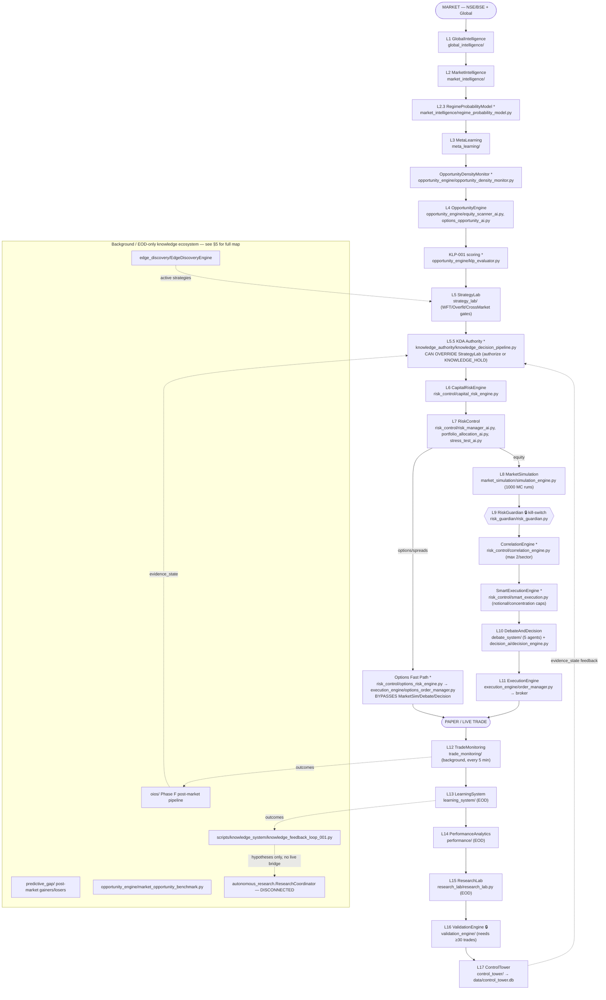

# SYSTEM-WIDE ARCHITECTURE, DATA-LINEAGE & OBJECTIVE AUDIT (V1)

**Date:** 2026-09-10
**Type:** READ-ONLY audit. No code, config, or data was modified to produce this document.
**Method:** Direct source inspection (grep + read, not doc-trusting) + 4 parallel read-only
research passes, cross-checked against each other and against live `master_orchestrator.py`
call sites. Where two sources disagreed, the disagreement is stated explicitly rather than
silently resolved — that itself is a finding (see §7).

**Scope boundary:** This document classifies and maps. It does not recommend deletion,
does not redesign anything, and does not change any wiring. Per explicit instruction, this
is a **truth map**, not an optimization pass.

---

## 1. Objective — what this system was built to do

Restated from `ARCHITECTURE.md` and `copilot-instructions.md`, since no separate
"objective" document exists:

> Take NSE equity/derivatives market data, run it through 17 sequential decision layers
> (regime → opportunity → strategy quality gate → capital sizing → risk → simulation →
> kill-switch → 5-agent debate → decision threshold), and place (paper, currently) trades
> only when a signal survives every gate — while continuously learning from outcomes to
> improve the same decision layers over time.

**The test every component in this audit is measured against:**
Does this component's output ever reach a place where it changes what the system trades,
how much it trades, or whether it trades — either directly (this cycle) or indirectly
(by changing a weight/threshold/eligibility file that a live layer reads next cycle)?

If the honest answer is "no, it only writes a report/file that nothing reads" — that is
recorded plainly, not euphemistically.

---

## 2. Master architecture diagram

This is **the one diagram**. It reflects the *verified* actual call sequence in
`orchestrator/master_orchestrator.py::run_full_cycle()`, not the aspirational 17-layer
list in `ARCHITECTURE.md` (which is out of date — see §3). Items marked `*` are real,
wired, production-affecting layers that exist in code but are **not** in `ARCHITECTURE.md`'s
layer table today.



**Reading this diagram:** the solid path (`MARKET` → ... → `ControlTower`) is what runs
**every intraday cycle**. The dotted arrows are the only two confirmed places where
downstream research/outcome data re-enters the live decision path: (1) `TradeMonitoring`
outcomes → OIOS → KDA `evidence_state`, and (2) `EdgeDiscoveryEngine` → `MetaStrategyController`
(inside StrategyLab). Everything else in the "Background" box is EOD-scheduled,
non-blocking, and — per §5 — largely a one-way street into files nothing reads back from.

---

## 3. ARCHITECTURE.md vs actual code — verified discrepancies

`ARCHITECTURE.md` is the canonical reference cited in `copilot-instructions.md`, but direct
inspection of `run_full_cycle()`, `_do_monitor()`, and `_do_eod_learning()` shows it is
**significantly behind the actual production call graph**. All 17 documented layers still
exist and still run — nothing here is wrong, it's incomplete.

**Confirmed present in code, absent from ARCHITECTURE.md's layer table:**

| # | Module | File | Wired at (line, approx) | Effect |
|---|---|---|---|---|
| 2.3 | RegimeProbabilityModel | `market_intelligence/regime_probability_model.py` | `run_full_cycle():1003` | Soft regime probabilities, blended 80/20 with ML weights |
| 5.5 | **KDA Authority** | `knowledge_authority/knowledge_decision_pipeline.py` | `:1154` (init `:308`) | Can add signals StrategyLab rejected, or block signals it approved (`KNOWLEDGE_HOLD`) |
| — | KLP-001 scoring | `opportunity_engine/klp_evaluator.py` | `:1082` | Annotates signals, records KNOWLEDGE_OBSERVATION |
| 6.5 | CorrelationEngine | `risk_control/correlation_engine.py` | `:1828` | Max 2 positions/sector, post-RiskGuardian |
| 6.7 | SmartExecutionEngine | `risk_control/smart_execution.py` | `:1891` | Notional/concentration filtering, pre-Debate |
| — | Options Fast Path | `risk_control/options_risk_engine.py` + `execution_engine/options_order_manager.py` | `:2535` | Bypasses MarketSimulation, Debate, DecisionEngine entirely for options/spreads |
| — | OpportunityDensityMonitor | `opportunity_engine/opportunity_density_monitor.py` | `:1038` | Directs scanner mode (NORMAL/AGGRESSIVE/CONSERVATIVE) |
| — | OIOS (69 files) | `oios/` | `_run_post_market_scan()` @ 16:45 IST | Full post-market research pipeline — see §5 |
| — | Edge Discovery | `edge_discovery/EdgeDiscoveryEngine` | `_do_eod_learning():~5609` | EOD; feeds `MetaStrategyController` |
| — | Weekend Intelligence | `orchestrator/weekend_intelligence.py` | Sat/Sun scheduler slots | Isolated from weekday cycle |
| — | Daily AI Self-Evaluator | `learning_system/daily_self_evaluation.py` | `_do_eod_learning():5682` | Telegram self-assessment |
| — | Strategy Performance Tracker | `learning_system/strategy_performance_tracker.py` | `_do_eod_learning():5573` | Auto-disable at <35% WR / 5 consecutive losses |
| — | Regime Strategy Map | `meta_learning/regime_strategy_map.py` | `_do_eod_learning():5584` | Regime→strategy win-rate learning |
| — | Market Opportunity Benchmark *(this session's addition)* | `opportunity_engine/market_opportunity_benchmark.py` | `_run_exploration_audit()` (called from `_do_eod_learning`), right after PRR-001 | Read-only A–F classification, feeds `rejection_audit.db` |

**KDA override mechanism — the single most architecturally significant undocumented
behavior found.** ARCHITECTURE.md describes it in one paragraph under "Layer 5"; the
code shows it is a full second-pass merge:

```
enriched_signals = StrategyLab(signals)              # pass 1: gate-approved subset
for original_signal in signals:                        # KDA evaluates ALL originals, not just approved
    kda_decision = knowledge_pipeline.run_knowledge_shadow(original_signal, ...)
    if kda_decision in (KNOWLEDGE_BUY, KNOWLEDGE_SELL):
        kda_authorized.add(original_signal.symbol)

merged = []
for sig in enriched_signals:                            # pass 2: filter StrategyLab-approved
    if kda_decision(sig) == KNOWLEDGE_HOLD:
        continue                                        # StrategyLab PASS overridden/blocked
    merged.append(sig)
for orig in signals:                                    # pass 3: add StrategyLab-rejected but KDA-authorized
    if orig.symbol in kda_authorized and orig not in merged:
        merged.append(orig)
# From here on, KDA-authorized signals skip StrategyLab's confidence floor,
# regime-compatibility veto, and ranking — by design (DTA-KDA-AUTHORITY-WIDEN-001).
```

**Recommendation for a future (separate, not-this-audit) documentation pass:** renumber
ARCHITECTURE.md's layer table to include 2.3, 5.5, 6.5, 6.7 explicitly, and add a
"Background Subsystems" section for OIOS/Edge Discovery/Weekend Intelligence. Not done here —
this audit only reports the gap.

---

## 4. Classification legend

| Symbol | Meaning |
|---|---|
| 🟢 LIVE+USED | Directly affects current decisions, this cycle |
| 🟡 LIVE+INDIRECTLY USED | Feeds evidence/state that a live layer reads on a later cycle |
| 🔵 RESEARCH ONLY | Runs, produces real output, but nothing in the live path reads it yet |
| 🟠 PERSISTED BUT UNUSED | Generates a file/DB but no reader was found anywhere in the codebase |
| 🔴 DEAD/DISCONNECTED | Exists, may even be well-tested, but has zero path into the running system |
| ⚪ DUPLICATE/REDUNDANT | Overlaps another mechanism that already does the same job |
| 🔒 PROTECTED | Load-bearing safety infrastructure — must not be touched without explicit approval |

---

## 5. File-wise map — Knowledge / Research ecosystem

This is the part of the system the user's concern is really about: the large amount of
accumulated "intelligence" work sitting alongside the 17-layer core. Verified by direct
grep of `orchestrator/master_orchestrator.py` for each module's import/call site.

| Module | What it does (1 line) | Wired into `master_orchestrator.py`? | Ultimate consumer | Classification |
|---|---|---|---|---|
| `knowledge_authority/knowledge_decision_pipeline.py` (KDA) | Shadow-evaluates every signal, can authorize/hold independent of StrategyLab | **YES** — init `:308`, called `:1154` | `risk_manager_ai.py` (skips confidence floor for KDA-authorized), `portfolio_allocation_ai.py` (sizing boost), merged into live signal list | 🟢 LIVE+USED |
| `knowledge_system/options_research_pipeline.py` | Options-specific pattern/hypothesis research | **YES** — conditional import `:270`, runs when options chain live | `options_risk_engine.py` state gates (VALIDATING→VALIDATED) | 🟢 LIVE+USED (options only) |
| `oios/` (69 files) — Phase F | Post-market OHLCV/BHAV refresh, leader capture, differential engine, signal-birth scanners (1A/1B), outcome resolution | **YES** — `_run_post_market_scan()` @ 16:45 IST | `outcome_tracker` feeds `evidence_state` transitions consumed by KDA | 🟡 LIVE+INDIRECTLY USED |
| `edge_discovery/EdgeDiscoveryEngine` | Mines new strategy edges from features→patterns→candidates→backtest→ranking | **YES** — EOD, `_do_eod_learning()` | `MetaStrategyController.get_active_strategies()` — StrategyLab actually trades these | 🟢 LIVE+USED |
| `market_learning/` (MLS + PIG integration) | Institutional DNA discovery, PMCI consensus scoring | **YES** — `pig_integration.py` wired at init, `pig_enrich_signals()` and `pig_build_vote()` called in cycle | Confidence enrichment (~1pt) in scanner; 8%-weighted additive vote in DecisionEngine, bounded by `PIGInfluencePolicy` | 🟢 LIVE+USED |
| `scripts/knowledge_system/knowledge_feedback_loop_001.py` + `knowledge_pattern_miner_001.py` | Mines statistical patterns from `shadow_evidence_ledger.jsonl`, generates research questions, tentatively registers hypotheses | **YES** — EOD, guarded by shadow-evidence existence check | `hypothesis_registry.json` (research tool) — **no live signal consumer found** | 🟡 LIVE+INDIRECTLY USED at best, closer to 🔵 RESEARCH ONLY — generates hypotheses a human/future-process would need to act on |
| `predictive_gap/` (PGA) | Post-market top-gainer/loser root-cause analysis (13 miss categories) | **YES** — EOD | None found — writes `reports/pga/*.md`, no reader | 🔵 RESEARCH ONLY (this session extended it via `broad_market_universe.py` + `market_opportunity_benchmark.py`, which DOES feed `rejection_audit.db` — see below) |
| `production_readiness/` (PRR-001, 9 gates) | Daily certification gate report | **YES** — EOD | None found — telemetry/logging only | 🔵 RESEARCH ONLY |
| `cle_learning_executor/` | Processes pending Cat-E DNA actions | **YES** — EOD | Writes to IDRRepository; **no confirmed downstream reader** | 🟠 PERSISTED BUT UNUSED (writer confirmed, reader not found) |
| `analysis/rejection_tracker.py` → `data/rejection_audit.db` | Records every rejection reason across CRE/RiskManager/Guardian/MarketBenchmark | **YES**, multiple writers (`master_orchestrator.py`, `capital_risk_engine.py`, this session's `market_opportunity_benchmark.py`) | **YES** — read by `knowledge_fusion_engine.py:200` (KFE counts rows as evidence pool member), `analysis/filter_scorecard.py`, `rejection_classifier.py` | 🟡 LIVE+INDIRECTLY USED — **status changed since ARCH-006**, which had flagged this file "DEPRECATE — redundant, no reader." It has a real reader again now. |
| `autonomous_research.ResearchCoordinator` | 8-stage pipeline: STUDY_PLAN→REPLAY→VALIDATION→EVIDENCE→KNOWLEDGE→SYNTHESIS→REPOSITORY→REPORT | **NO** — confirmed via direct grep, zero references in `master_orchestrator.py` | None | 🔴 DEAD/DISCONNECTED — confirmed unchanged since ARCH-006 (2026-08-22), intentional |
| `growth_validator/` (GVA) | Daily growth-evidence collection & report | **NO** — manual invocation only | None | 🔴 DEAD/DISCONNECTED (by design — manual audit tool, not a defect) |
| `decision_tracer/` (DTA) | Manual symbol-specific decision trace CLI | **NO** | None | 🔴 DEAD/DISCONNECTED (by design — debugging tool) |
| `hkap/` | Historical Knowledge Acquisition Program (2020+ replay) | **NO** | None | 🔴 DEAD/DISCONNECTED — standalone research tool |
| `ikn/` (Institutional Knowledge Network) | Graph queries over DNA/evidence | **NO** | None | 🔴 DEAD/DISCONNECTED — standalone utility |
| `release_manager/` | Version/config snapshot, freeze/release tagging | **NO** (from trading cycle) — runs at container startup/deploy only | Deployment pipeline (correct, separate concern) | 🔒 PROTECTED (deployment infra, not a trading-decision component) |

### 5.1 Unresolved contradiction — flagged, not silently resolved

One research pass (report-cataloging focus) concluded `autonomous_research/scientific_director.py`
and `ResearchCoordinator` are **"ACTIVE — wired to live... called by orchestrator"**, based on
reading design docs and module `__init__.py` exports. A second, code-tracing-only pass
(reading `master_orchestrator.py` line by line) found **zero call sites** for either name.
Direct verification via `grep -rn "ResearchCoordinator|scientific_director" orchestrator/master_orchestrator.py`
in this session confirms: **zero matches**. The correct status is 🔴 DEAD/DISCONNECTED for both.

**This contradiction is itself the most important finding in this audit.** A module being
importable, exported from `__init__.py`, referenced in design docs, or "sounding load-bearing"
is not evidence it runs. Only a direct call-site grep against the orchestrator proves
liveness. Any future audit (automated or human) must re-verify against code, not against
prior documentation, including this document a year from now.

---

## 6. Data store lineage — critical path vs dead ends

Verified by grepping the codebase for each filename (producer = write site, consumer = read site).

### 🟢 On the live critical path (would degrade real trading if lost)

| Store | Producer | Consumer | Decision impact |
|---|---|---|---|
| `data/control_tower.db` | `control_tower/telemetry_logger.py` | Dashboard, cycle-stat consumers | Observability backbone |
| `data/trading_brain.db` | `database/db_manager.py` (every trade/position write) | `OrderManager`, RiskControl layers | Position/capital state |
| `data/risk_guardian_state.json` | `RiskGuardian.record_trade_result()` | Restored on startup, checked every cycle | Kill-switch survives restarts |
| `data/strategy_performance.json` | `StrategyPerformanceTracker` | `MetaStrategyController`, `PortfolioAllocationAI` | Auto-disable, capacity sizing |
| `data/evolved_strategies.json` | `StrategyEvolutionAI`, `edge_discovery` | `MetaStrategyController` (loaded at init) | Strategy selection pool |
| `data/regime_strategy_map.json` | `RegimeStrategyMap` | `MetaStrategyController.rank_strategies()` | Regime-weighted strategy ranking |
| `data/paper_trading_daily.json` | `_do_eod_learning()` | Incident manager (loss>2% halt check) | Halt trigger |
| `data/live_selection_eligibility.json` | `live_selection_eligibility_001.py` (EOD) | `EquityScannerAI` scan-time confidence nudge | Bounded, audited nudge only — never an override |
| `data/knowledge_evidence_ledger.jsonl`, `data/shadow_evidence_ledger.jsonl` | LOL bridge, KLP evidence adapter | `knowledge_fusion_engine.py` → KDA `evidence_state` | Feeds the ONE confirmed live research→decision bridge |
| `data/rejection_audit.db` | `rejection_tracker.py` (now 4+ writers incl. this session's new benchmark) | `knowledge_fusion_engine.py:200`, `filter_scorecard.py` | Revived since ARCH-006 flagged it for deprecation |

### 🟠 Persisted but unused / observational only (safe today, but "generated ≠ consumed")

| Store | Producer | Consumer found? |
|---|---|---|
| `data/scanner_memory.json` | `candidate_store.py` | Only a premarket *report* reads it, no decision consumer |
| `data/odm_state.json` | `OpportunityDensityMonitor` | Read only at startup restore, not during live decisions thereafter |
| `data/knowledge_pipeline_health.json` | `knowledge_feedback_loop_001.py` | Only a health-check script (stale-file detection), no decision logic |
| `data/discovered_edges.json` | `EdgeRankingEngine` | Research-only readers (KnowledgeProvider case studies, GVA) — **note:** the *active* strategy pool actually comes from `evolved_strategies.json`, not this file — worth resolving which one `MetaStrategyController` truly prefers in a future (non-audit) session |
| `data/ars_hypothesis_registry.json` | `HypothesisRegistry` | Only `ResearchCoordinator` (🔴 disconnected) and GVA (🔴 disconnected) |
| `data/fingerprint_discovery_daily.jsonl` | `fingerprint_discovery_001.py` | Post-hoc audit scripts only |
| `data/champion_challenger_registry.jsonl` | `champion_challenger_001.py` | Research pipeline only, not executed live |
| `data/ml_performance_dataset.json` | `meta_learning/performance_dataset.py` | Offline ML training scripts only |

**No fully "zero-consumer" file was found** — every producer has at least one reader
somewhere. But several readers are themselves 🔴 disconnected (ResearchCoordinator, GVA),
which means the true end of that chain is nobody. That distinction — "has a reader" vs
"the reader itself leads anywhere" — is the honest answer to "generated but not consumed."

---

## 7. Documentation debt — the ~270 markdown reports

A full inventory (28 clusters) was produced; full detail available on request, but the
headline numbers:

- **~270 markdown files at repo root.** Roughly **100 of them** are dated, single-day
  forensic/pilot audits from the Aug 2026 pilot period — their findings are already merged
  into code; the documents themselves are historical record, not active reference.
- **~150+ one-off root-level `.py` scripts** (`debug_*`, `check_*`, `fix_*`, `probe_*`,
  `smoke_*`, `inspect_*`, `patch_*`, `audit_*`) — confirmed via grep that **none** of these
  prefixed scripts are imported by production code. They are standalone CLI tools used
  once, historically, then left in place.
- **Active, still-authoritative reference docs:** `ARCHITECTURE.md` (now confirmed
  incomplete, §3), the `ARCH_00X` closure series (issues fixed, deployed, verified),
  `DHAN_OAUTH_*` (daily operational need), and the per-subsystem `*_ARCHITECTURE.md` design
  docs where the corresponding module still exists and runs.
- **Not deleted or moved as part of this audit** — per explicit instruction, this is a map,
  not a cleanup.

---

## 8. System Index (representative sample, not exhaustive)

Given ~150 root scripts and ~270 reports, an exhaustive per-file table is not a useful
deliverable (it would be thousands of rows, most `NO CONSUMER — historical`). Instead,
this table shows the pattern with concrete, representative entries — this format can be
mechanically extended to any file the user wants traced next.

| Component | Inputs | Output | Consumer | Live decision impact | Status |
|---|---|---|---|---|---|
| `opportunity_engine/market_opportunity_benchmark.py` (this session) | `nifty500_universe.json`, `shadow_evidence_ledger.jsonl`, `control_tower.db`, yfinance | `data/market_benchmark/*.jsonl`+`.md`, `rejection_audit.db` rows | `knowledge_fusion_engine.py` (via rejection_audit.db) | 🟡 Indirect | LIVE+INDIRECTLY USED |
| `analysis/rejection_tracker.py` | Rejection events from CRE/RiskManager/Guardian/Benchmark | `rejection_audit.db` | `knowledge_fusion_engine.py`, `filter_scorecard.py` | 🟡 Indirect | LIVE+INDIRECTLY USED (revived, was flagged DEPRECATE in ARCH-006) |
| `edge_discovery/EdgeDiscoveryEngine` | Closed trade outcomes, feature DB | `data/discovered_edges.json`/`.jsonl` | `MetaStrategyController.get_active_strategies()` | 🟢 Direct | LIVE+USED |
| `autonomous_research/research_coordinator.py` | Would consume KnowledgeProvider, HypothesisRegistry | `study_plans.jsonl`, `validated_evidence.jsonl` | **NONE — zero call sites in master_orchestrator.py** | None | DEAD/DISCONNECTED |
| `growth_validator/gva_runner.py` | HistoricalBehaviourEngine, trade outcomes | `reports/gva/growth_report_*.md` | Manual read only | None | RESEARCH ONLY (by design) |
| `cle_learning_executor/run_cat_e_learning.py` | LearningRegistry PENDING actions | IDRRepository records | **No confirmed reader found** | Unknown/likely none | PERSISTED BUT UNUSED |
| `hkap/` (`run_hkap.py`) | yfinance 2020+ history | `reports/hkap/yearly_summary_*.md` | Manual read only | None | RESEARCH ONLY (by design) |
| ~150 root `debug_*/check_*/fix_*/probe_*` scripts | Varies (mostly Dhan API, token, DB state) | stdout / one-off files | Human operator, one time | None | HISTORICAL — not part of running system |

---

## 9. Does the system serve its original objective?

**Yes, for the core 17(+6 undocumented) layer decision path** — verified end-to-end this
session: a signal really does flow from market data through StrategyLab/KDA gating,
capital sizing, multi-layer risk checks, a hard kill-switch, a 5-agent debate, and only
then to execution. `RiskGuardian` and `ValidationEngine` are correctly protected and still
enforce their original gates. The one confirmed live research→decision feedback loop
(TradeMonitor outcomes → OIOS → KDA `evidence_state` → `risk_manager_ai.py`/
`portfolio_allocation_ai.py`) is real and verified by direct code trace, not assumption.

**Partially, for the accumulated knowledge/research ecosystem.** A large amount of
genuinely sophisticated work (OIOS, market_learning/PMCI, edge_discovery, KDA itself) *is*
live and *does* influence trades. But a comparable amount (ResearchCoordinator, GVA,
decision_tracer, hkap, ikn, cle_learning_executor's downstream, PGA, PRR-001,
knowledge_feedback_loop's hypothesis output) produces real, often high-quality analysis
that currently terminates in a file or report with no further consumer. None of this is
necessarily wrong to have — research-only and manual-audit tools have legitimate value —
but conflating "this analysis exists and looks rigorous" with "this analysis changes what
the system trades" is the exact failure mode the user described, and this audit found
concrete instances of it (§5, §6, §7.1).

**Documentation itself has drifted from code** (§3) — ARCHITECTURE.md, the primary
reference, undercounts the live decision path by 6+ real layers. Any future change made by
trusting ARCHITECTURE.md alone (without re-verifying against `master_orchestrator.py`) risks
being made against a wrong mental model of the system.

---

## 10. What this audit deliberately does NOT do

- Does not delete, move, or archive any file.
- Does not change any wiring, threshold, or configuration.
- Does not decide whether `ResearchCoordinator`/GVA/hkap/ikn *should* be wired in —
  only reports that they currently are not.
- Does not resolve the `discovered_edges.json` vs `evolved_strategies.json` question in
  §6 — flagged for a future, separate, explicitly-authorized session.
- Does not attempt to individually catalog all ~270 reports or ~150 scripts — §7/§8
  give cluster-level and representative-sample detail; a full per-file table can be
  produced on request for a specific subsystem if needed.

---

*This document should be re-verified against code the next time it is relied upon —
per §5.1, code drifts faster than documentation, including this one.*
