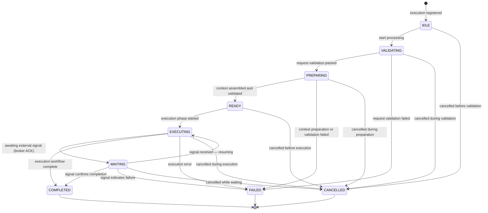
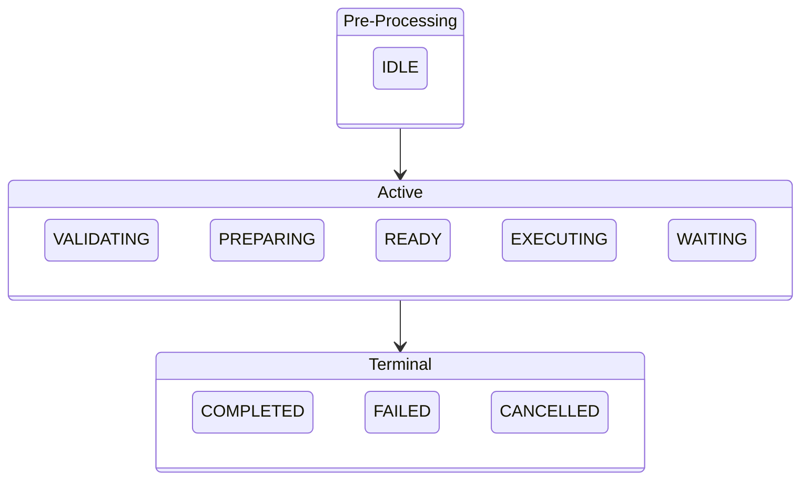

# Execution Engine — State Diagram

All 9 engine execution states and all legal transitions.

---

## Event Emitted on State Entry

| State entered | Event type |
|---|---|
| IDLE | *(no event)* |
| VALIDATING | `EXECUTION_STARTED` |
| PREPARING | `EXECUTION_VALIDATED` |
| READY | `EXECUTION_PREPARED` |
| EXECUTING | `EXECUTION_READY` |
| WAITING | *(no event)* |
| COMPLETED | `EXECUTION_COMPLETED` |
| FAILED | `EXECUTION_FAILED` |
| CANCELLED | `EXECUTION_CANCELLED` |

---

## State Groups

---

## Transition Count Summary

| From State | Outgoing transitions |
|---|---|
| IDLE | 2 |
| VALIDATING | 3 |
| PREPARING | 3 |
| READY | 2 |
| EXECUTING | 4 |
| WAITING | 4 |
| COMPLETED | 0 *(terminal)* |
| FAILED | 0 *(terminal)* |
| CANCELLED | 0 *(terminal)* |
