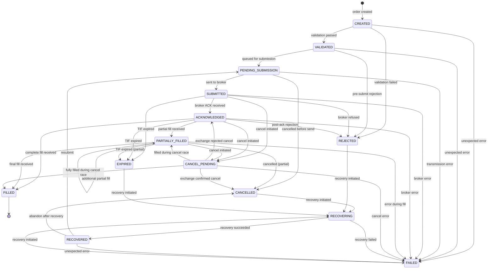
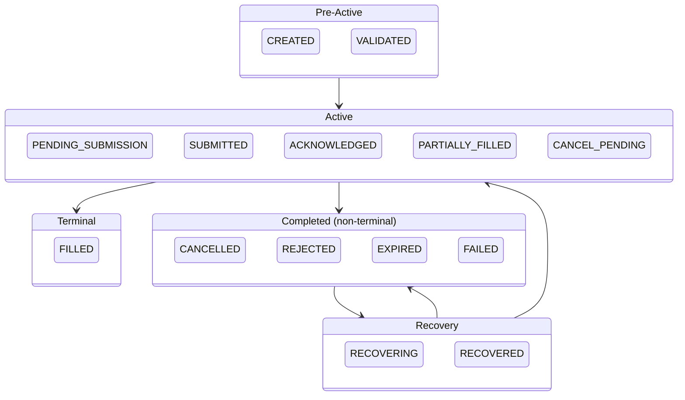

# Order Lifecycle — State Diagram

All 14 states and all legal transitions.

---

## State Groups

---

## Transition Count Summary

| From State | Outgoing transitions |
|---|---|
| CREATED | 3 |
| VALIDATED | 3 |
| PENDING_SUBMISSION | 3 |
| SUBMITTED | 5 |
| ACKNOWLEDGED | 6 |
| PARTIALLY_FILLED | 6 |
| CANCEL_PENDING | 5 |
| FILLED | **0 — terminal** |
| CANCELLED | 1 |
| REJECTED | 1 |
| EXPIRED | 1 |
| FAILED | 1 |
| RECOVERING | 2 |
| RECOVERED | 3 |
