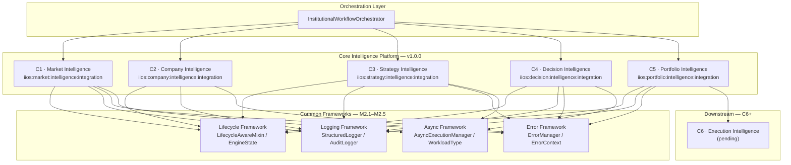
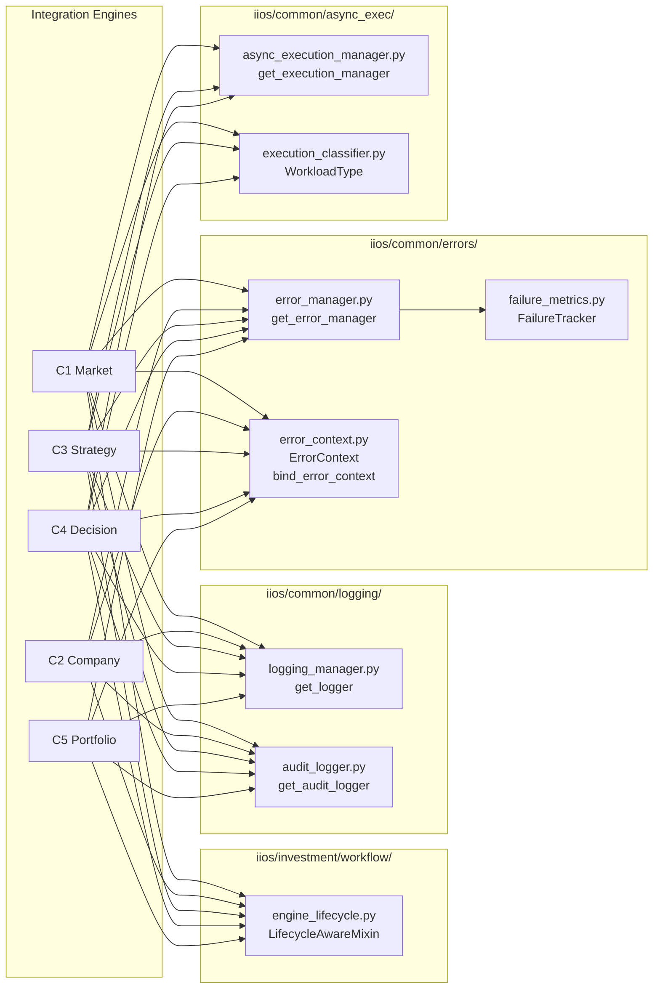
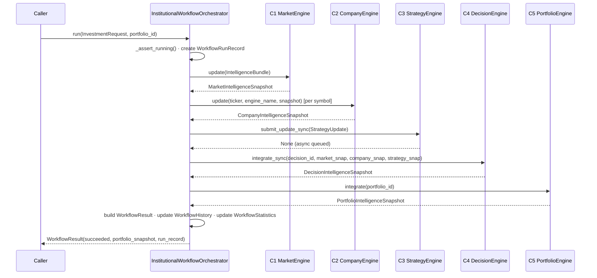
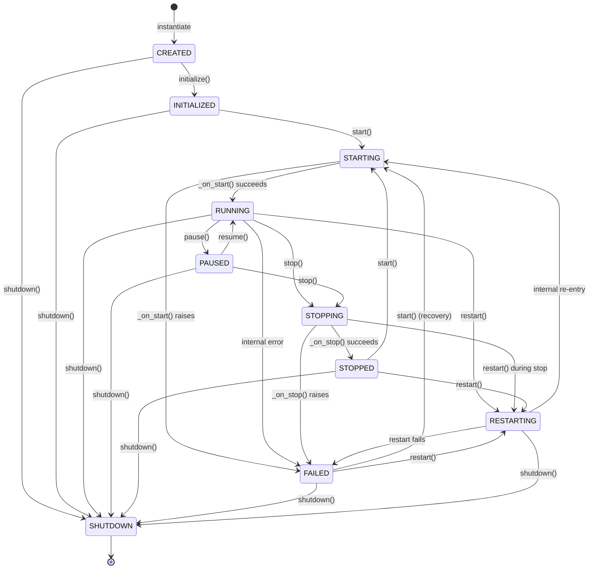
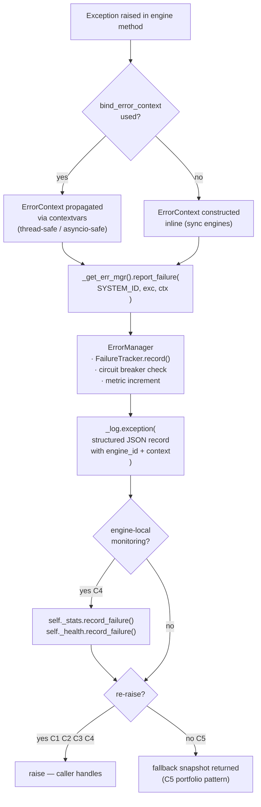
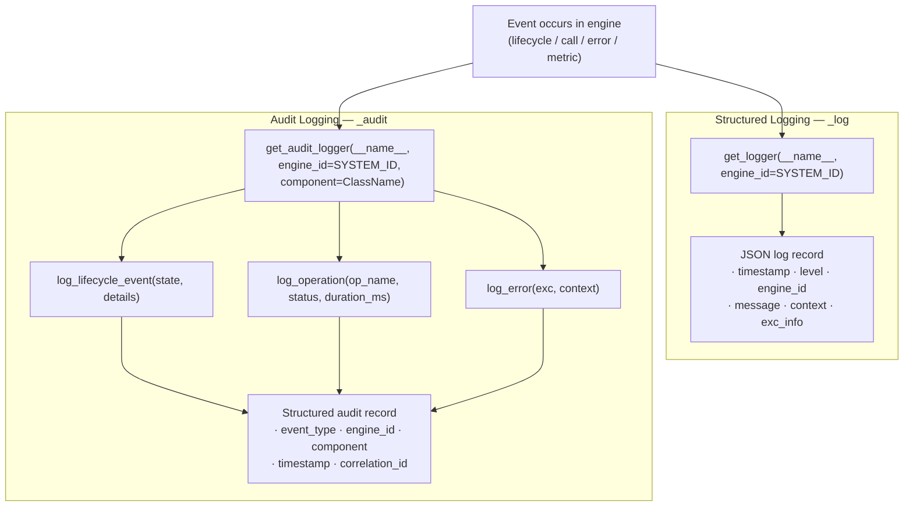
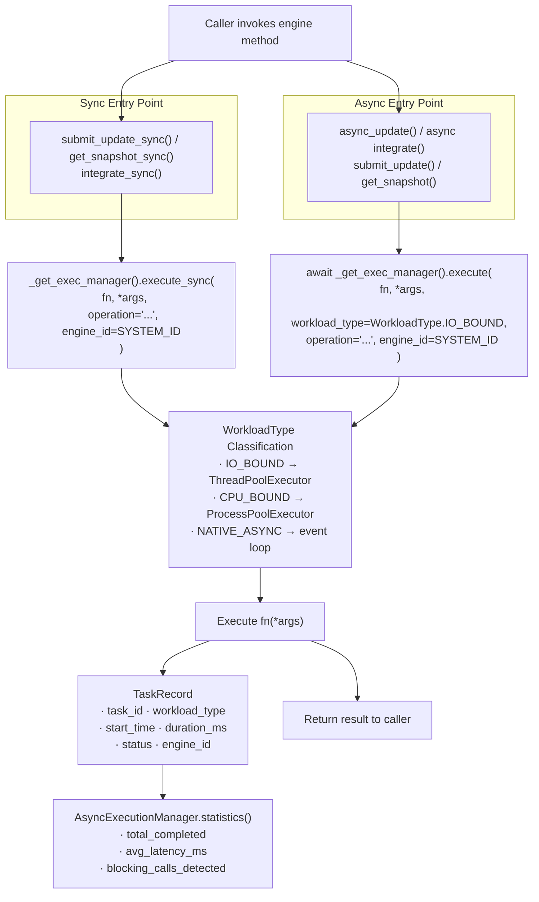

# IIOS Core Intelligence Platform — Architecture Diagrams

**Release:** v1.0.0-core-intelligence  
**Date:** 2026-07-16  
**Scope:** C1–C5 Integration Engines + M2.1–M2.5 Common Frameworks

---

## 1. Platform Architecture Diagram

High-level view of the Core Intelligence Platform and its position in the IIOS stack.

---

## 2. Dependency Diagram

Import relationships between integration engines and common framework modules.

---

## 3. Workflow Diagram

End-to-end pipeline through `InstitutionalWorkflowOrchestrator.run()`.

---

## 4. Lifecycle State Machine

`EngineState` transitions for all C1–C5 engines via `LifecycleAwareMixin`.

---

## 5. Error Flow

Path an exception takes from point of raise through the error framework.

---

## 6. Logging Flow

How log and audit events are emitted from integration engines.

---

## 7. Async Execution Flow

How C1, C3, and C4 dispatch work through `AsyncExecutionManager`.

