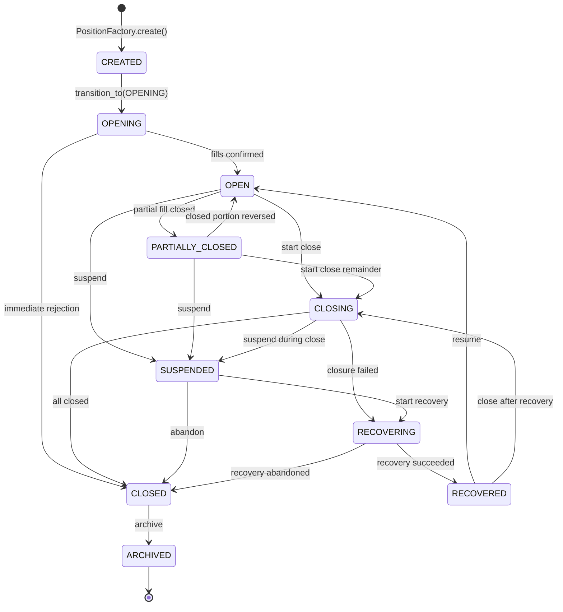

# Position Lifecycle — State Diagram

**C6 Execution Intelligence · Phase 3 · Module 1**

---

## Full state machine

---

## State groups

| Group | States |
|-------|--------|
| Active | OPENING, OPEN, PARTIALLY_CLOSED, CLOSING |
| Suspended | SUSPENDED, RECOVERING, RECOVERED |
| Closed | CLOSED, ARCHIVED |
| Terminal | ARCHIVED |

---

## Transition table

| From | Allowed targets |
|------|----------------|
| CREATED | OPENING |
| OPENING | OPEN, CLOSED |
| OPEN | PARTIALLY_CLOSED, CLOSING, SUSPENDED |
| PARTIALLY_CLOSED | CLOSING, OPEN, SUSPENDED |
| CLOSING | CLOSED, SUSPENDED, RECOVERING |
| CLOSED | ARCHIVED |
| SUSPENDED | RECOVERING, CLOSED |
| RECOVERING | RECOVERED, CLOSED |
| RECOVERED | OPEN, CLOSING |
| ARCHIVED | *(terminal — no outgoing edges)* |
