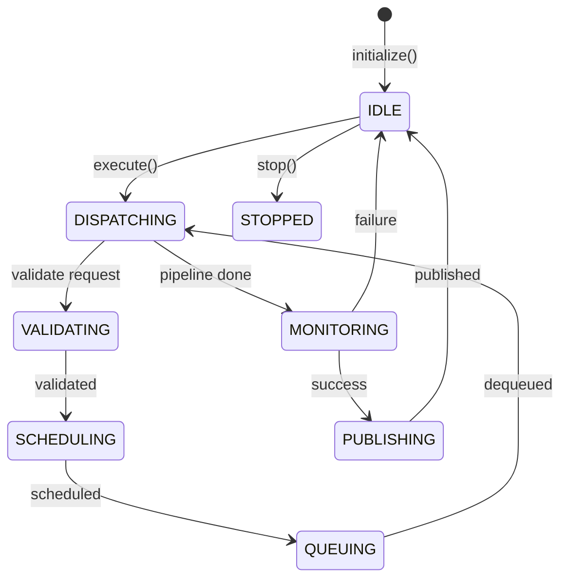

# Workflow Engine Guide

## Engine Lifecycle

```
IDLE → INITIALIZING → VALIDATING → IDLE
```

On each request:

```
IDLE → VALIDATING → SCHEDULING → QUEUING → DISPATCHING → MONITORING → PUBLISHING → IDLE
```

## execute() Flow

1. Validate request (6 checks)
2. Create M1 session → initialize → validate → mark_ready
3. Schedule via WorkflowScheduler
4. Dequeue → start M1 session
5. Dispatch through WorkflowPipeline (8 stages)
6. Monitor → complete or fail M1 session
7. Publish event
8. Return WorkflowEngineResponse

The engine **never raises** for workflow-level failures — it returns a `WorkflowEngineResponse` with `status=FAILED`.

## Engine State Transitions



## M3/M4 Hooks

The engine exposes two extension hooks for future modules:

```python
engine.register_governance_hook(my_m3_hook)    # M3: governance policy
engine.register_orchestration_hook(my_m4_hook) # M4: orchestration
```

Both hooks receive `(request, context)` and may return a `Dict` (ignored in passthrough mode).

## Statistics

```python
report = manager.statistics()
print(report.workflows_executed)
print(report.workflow_availability)   # 0.0–1.0 rolling ratio
```

## Events

```python
bus = manager.event_bus()
bus.add_listener(WorkflowEngineEventType.WORKFLOW_COMPLETED, my_handler)
```

Event types: WORKFLOW_INITIALIZED, WORKFLOW_VALIDATED, WORKFLOW_QUEUED,
WORKFLOW_DISPATCHED, WORKFLOW_STARTED, WORKFLOW_COMPLETED, WORKFLOW_FAILED,
WORKFLOW_CANCELLED, WORKFLOW_SNAPSHOT_PUBLISHED

## Health and Status

```python
health = manager.health()
assert health.status in ("healthy", "degraded", "unhealthy")

status = manager.status()
print(status.state, status.active_requests, status.queue_size)
```
